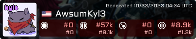

# ModeFlex

Forum signature generator showing your rank in all four osu! gamemodes (global and country)!

It's run whitelist-only; this means that only the user IDs that you specify will have their stats generated.

You can also use the `banner` query argument to change the background. To add more banners, just add `400x80` images
into the folder `assets/banners`!

## Install

- Clone the repo
- Build
- Rename `configexample.yaml` to `config.yaml` and fill out the values in it.
- Run the binary how you like
- Done! Head to `/card?id=OsuUserID` and check out your card!

## Use

In osu!:

`[img]https://example.com/card?id=youridhere&randomquery=adksajljsf[/img]`

Elsewhere, you can just use the image link.

